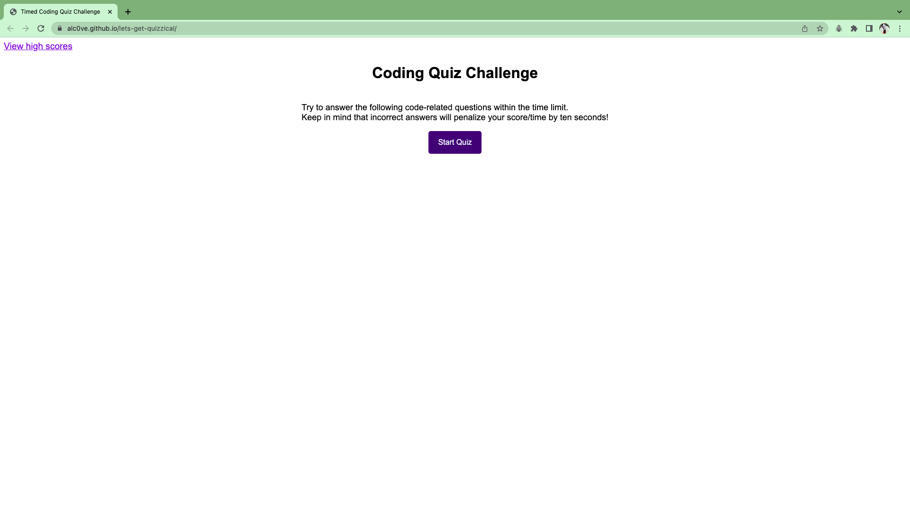
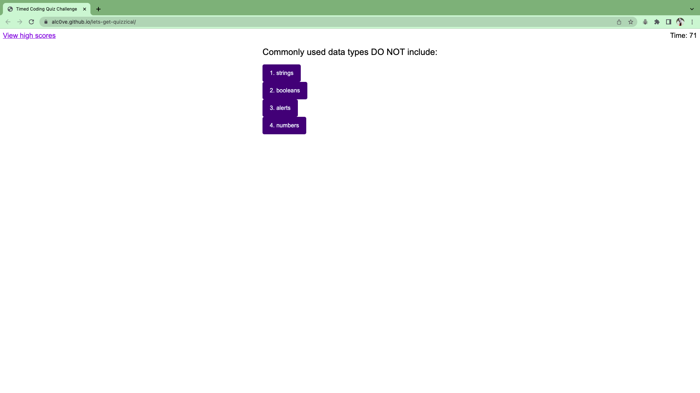

# lets-get-quizzical

## Description

As a coding bootcamp student, I wanted to make a quiz for a fun way to help retain basic information about things that we are learning. I used tools that I learned in DOM to help build this quiz. The quiz is timed so user will have to think somewhat quickly on their answers before time runs out. Scores will be added at the end and presented, as well as leave their mark by providing initials. I learned further about arrays, use of arrays, indexing, different ways/syntaxes, how to make a timer and take time away with click events, click events in general, function values (), and so many DOM methods were researched. 

## Installation 🤯

I started the quiz app with a blank slate. I started to put everything in index.html, then remembered DOM methods. I utilized some of that and moved the entire question & answers page into the JavaScript file. The start page, end page, and high scores page remain in html to help divide the pages up. I had to figure out visibility of pages, so I ended up using both methods. In the future, I will use one so that the code can look much more cleaner. For this application I wanted to keep it to see how they both work. I used more CSS than I thought I would to style things individually. I will return to it to see if I can optimize it. I then set up a timer to decrease by one second starting from 75 seconds. I had to figure out how to organize the functions so everything will run smoothly. I had help from a classmate on revolving questions and it helped me put adding the scores and removing seconds for certain answers. I had to figure out how to utilize local storage to pull initials that user input and the total sum of the score. I had to figure out how to display on another page if the user would like to go back and compare scores. I had to also add a button that will take user back to the beginning to take quiz again.

## Usage

The user will begin at the start page where an explanation of the quiz is presented. The user then clicks "Start Quiz" to start quiz as well as the timer. User has 75 seconds to complete the quiz. There are nine questions total. Correct answers will earn the user ten points, and wrong answers will deduct ten seconds from the timer. Once the quiz comes to an end, or the user runs out of time, the screen will display total score and have a box for the user to input their initials and a submit button. There will also be a link at the top left corner where the user can go back and review high scores.

Screenshot of quiz page:

Screenshot of quiz in action:

Link to take quiz: https://alc0ve.github.io/lets-get-quizzical/

GitHub: https://github.com/alc0ve/lets-get-quizzical

## Credits

I'd like to thank BJ for a lot of my understanding in making this application. He was able to explain it to me in a way that I comprehended instead of reading it off of a page. He would make an awesome tutor! Thanks to my tutor, Brandon Rose, for helping me debug scores and seconds taken away issues. He also went through and clarified use of local storage and showed me an abundance of ways I could go about using that data. I have also listed some websites that helped me along the way. Thanks Celeste, one of the TAs, for helping me as well! 

This is the website that initially showed me how to make a list from answer array.
https://www.geeksforgeeks.org/how-to-creating-html-list-from-javascript-array/
I had my questions as textContent and was going to write them individually, as opposed to a giant array.

This is the website that helped me understand putting things in an array and getting boolean value. Also gave me an idea of setting up my array differently.
https://stackoverflow.com/questions/55815871/getting-boolean-value-from-object-in-array-then-assigning-it-a-dom-property

This is the youtube video that shows how much neater it is to combine questions and answers together in array form, as well as other tricks I can utilize in the future.
https://www.youtube.com/watch?v=riDzcEQbX6k

